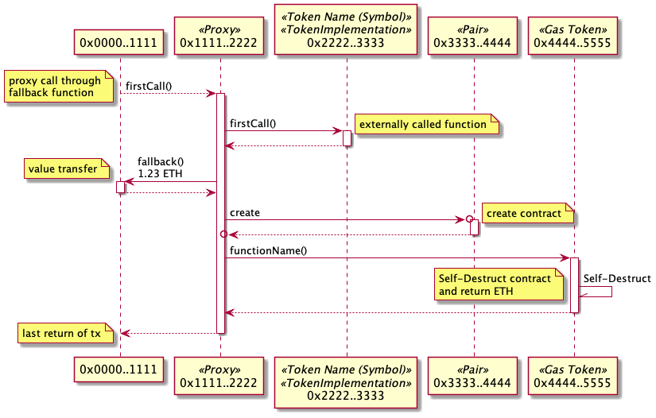

# Ethereum transaction to UML sequence diagram generator

[](https://badge.fury.io/js/tx2uml)

[Unified Modeling Language (UML)](https://en.wikipedia.org/wiki/Unified_Modeling_Language) sequence diagram generator for Ethereum transaction.


See more examples under the [examples](./examples/README.md#example-uml-sequence-diagrams)

# Install

The following installation assumes [Node.js](https://nodejs.org/en/download/) has already been installed which comes with [Node Package Manager (NPM)](https://www.npmjs.com/).

To install globally so you can run `tx2uml` from anywhere

```bash
npm link tx2uml --only=production
```

To upgrade run

```bash
npm upgrade tx2uml -g
```

To see which version you are using

```bash
npm ls tx2uml
```

# Usage

## Command Line Interface (CLI)

Use the `-h` option to see the `tx2uml` CLI usage options

```
$ tx2uml -h
Usage: tx2uml <txHash> [options]

Generates a UML sequence diagram for a transaction's contract calls.

Options:
  -f, --outputFormat <value>    output file format: png, svg or puml (default: "png")
  -o, --outputFileName <value>  output file name
  -n, --network <network>       mainnet, ropsten, kovan or rinkeby (default: "mainnet")
  -e, --etherscanApiKey <key>   Etherscan API Key
  -a, --alethioApiKey <key>     Alethio API Key
  -p, --params                  show function params and return values (default: false)
  -g, --gas                     show gas usages (default: false)
  -v, --verbose                 run with debugging statements (default: false)
  -h, --help                    output usage information
```

# Syntax



## Participants

The participant names are shortened contract addresses. Basically, the first and last 2 bytes in hexadecimal format with a 0x prefix.

Stereotypes are added for the contract and token name if they can be sourced. The contract name comes from Etherscan's verified contracts. The token name comes from Alethio.

## Messages

There are five types of messages

- **Call** an external contract call shown as a filled arrow head at the to contract.
- **Return** of a call shown as a dotted line with the filled arrow head.
- **Value** transfer of Ether shown as an open arrow head with the amount in Ethers
- **Create** a new contract with
- **Selfdestruct** shown as a dotted lined with a filled arrow head

# Data Source

## Alethio

All the contract calls are sourced from [Alethio](https://aleth.io/). Specifically, the [Contract Messages API](https://docs.aleth.io/api#tag/Contracts/paths/~1contracts~1{address}~1contractMessages/get) which as already done the hard work of parsing the transaction trace to extract the contract call details.

The Alethio API is free for volumes less than 10,000 calls a month. After that you'll need an API key from https://developers.aleth.io/. In order to trace large transactions, over a dozen Alethio calls can be made for one transaction as contract messages are limited to 100 messages per API call.

## Etherscan

The contract names are sourced from the verified contracts on [Etherscan](https://etherscan.io/), Specifically, the [get source code](https://etherscan.io/apis#contracts) API which includes the contract name if the contract has already been verified.

## PlantUML

[PlantUML](http://plantuml.com) is used to render the UML sequence diagrams.

This tool uses the [node-plantuml](https://www.npmjs.com/package/node-plantuml) package to convert Plant UML into png and svg files which it does by using the Plant UML Java archive file.

To manually convert a puml file to png, run

```
cd examples
puml generate syntax.puml -o syntax.png
```

### VS Code extension

[Jebbs PlantUML](https://marketplace.visualstudio.com/items?itemName=jebbs.plantuml) extension for VS Code is used to authoring the PlantUML diagrams.

`Alt-D` on Windows, or `Option-D` on Mac, to stat PlantUML preview in VS Code.

# UML Syntax

Good online resources for learning UML

- [UML 2 Sequence Diagramming Guidelines](http://www.agilemodeling.com/style/sequenceDiagram.htm)
- [PlantUML Sequence diagrams](https://plantuml.com/sequence-diagram)

# Similar transaction visualisation tools

- [Parity Trace Decoder](https://github.com/k06a/parity-trace-decoder)
- [Tenderly](https://dashboard.tenderly.dev/)
- [EthTx info](http://ethtx.info/)
- [Bloxy](https://bloxy.info/)
- [Etherscan](https://etherscan.io/txs)

## Development

npm test, build and publish commands

```bash
npm run test
npm run prettier:fix
npm run build
# make tx2uml globally available
npm link
npm publish
```
